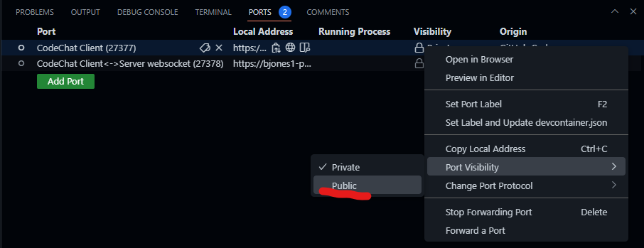

# Runestone Codespace

Use this template repository to quickly start a new [Runestone](https://runestone.academy) project entirely in the cloud, using GitHub Codespaces.

## Instructions

Look for the green button at the top right of this page. If the button says `Use this template`, then you are ready to create a new repository for your project. Click on the button and select "Create a new repository". On the next page, give your project a name, select public or private (this can be changed later), and click the "Create repository from template" button.

You now have a GitHub repository saved in your account. You can come back to that page any time you want to work on your project (note the URL or else find it in the list of your repositories when you log in to GitHub).

To start work on your project, go to the green button at the top of _your_ repository's page, which will say `<> Code`.

1. Click on this button.
2. Click on the tab that says "Codespaces."
3. Click "Create codespace on main."

This take a minute or two (just the first time; later this will be much faster) and then open a browser version of VS Code with everything set up to start working. It will generate a new pretext book (and replace this README with one you can edit for your project).

Next time you want to work on your book, return to your newly created repository, go to the green `<> Code` button, and select the codespace you previously created. If you don't see that codespace (perhaps you deleted it to save space), you can always create a new codespace.

## Manual steps after start

After the container has fully started, switch to the Ports tab, then right-click on the visibility of ports 27377 and 27378 and set them as public. Unfortunately, there's no way to do this automatically yet.

## Credits

This file was mostly copied from the [PreTeXt Codespace](https://github.com/PreTeXtBook/pretext-codespace/blob/main/README.md)
